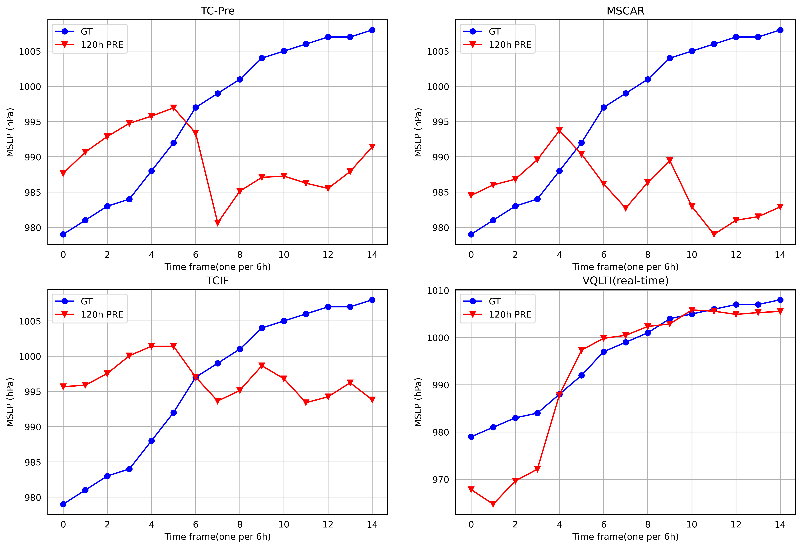
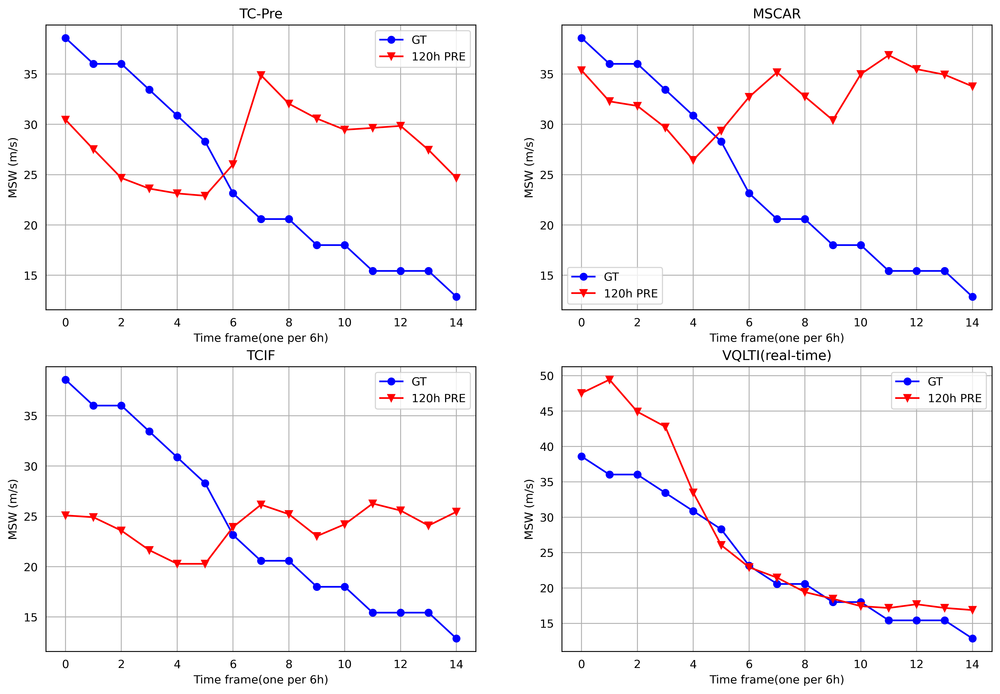

# VQLTI: Long-Term Tropical Cyclone Intensity Forecasting with Physical Constraints

### Data Processing

You can download the datasets and models related to this experiment through the following link.

ERA5 dataset: https://www.ecmwf.int/en/forecasts/dataset/ecmwf-reanalysis-v5

FengWu Model: [GitHub - OpenEarthLab/FengWu](https://github.com/OpenEarthLab/FengWu)

IBTrACS dataset (best): [International Best Track Archive for Climate Stewardship (IBTrACS) | National Centers for Environmental Information (NCEI)](https://www.ncei.noaa.gov/products/international-best-track-archive)

Potential Intensity: [GitHub - dgilford/tcpyPI: tcpyPI, aka &quot;pyPI&quot;: Tropical Cyclone Potential Intensity Calculations in Python](https://github.com/dgilford/tcpyPI)

We have made available the test data and pre-trained models. Additionally, we have packaged an onnx model that enables real-time forecasting testing, which you can download through the provided link.

link: [VQLTI_datasets_and_onnx.zip](https://1drv.ms/u/s!AmZf5d3YaPT5okgxrSRp-38DT3Wy?e=eIi4Nj)

The model can be configured by modifying the yaml file. The code has provided the corresponding default yaml parameter values.

## Train

```
bash train_bash.sh
```

## Test

```
bash inference_bash.sh
```

## Case





## Citation
```
Wang, X., Liu, L., Chen, K., Han, T., Li, B., & Bai, L. (2025). VQLTI: Long-Term Tropical Cyclone Intensity Forecasting with Physical Constraints. Proceedings of the AAAI Conference on Artificial Intelligence, 39(27), 28476-28484. https://doi.org/10.1609/aaai.v39i27.35070
```
